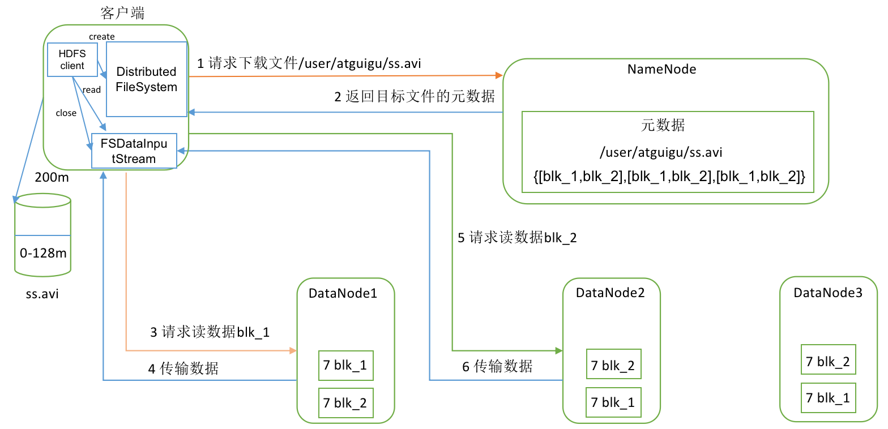
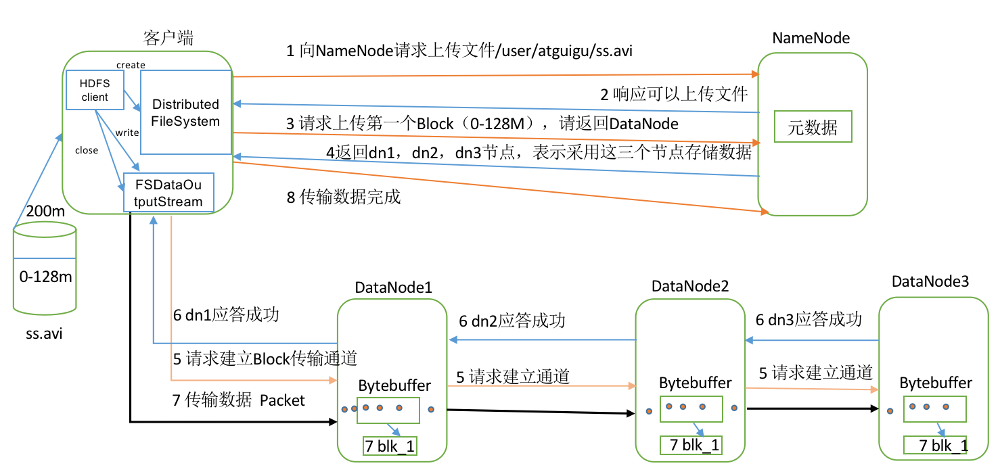
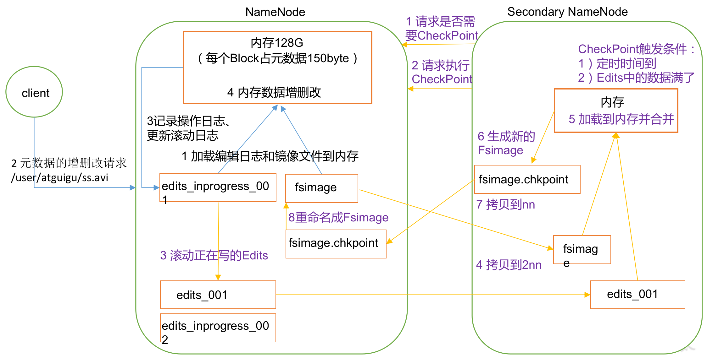
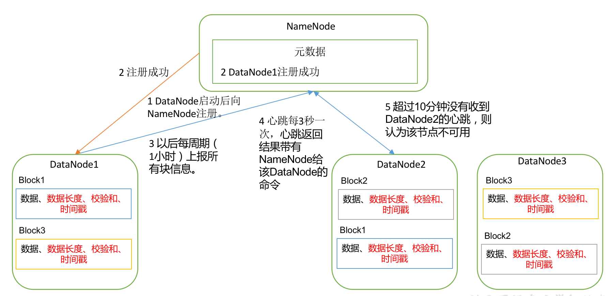

[TOC]

## 1、HDFS组成架构


- Client（客户端）：访问 HDFS 的程序或者 HDFS 的 Shell 操作都可以认为是 HDFS 的客户端。
   - 负责文件切分。文件上传 HDFS 的时候，Client 将文件切分成一个个 Block，然后进行上传。
   
   - 与 NameNode 进行交互，获取文件的位置信息。
   
   - 与 DataNode 交互，读取或者写入数据。
   
   - Client 提供一些命令来管理 HDFS，比如 NameNode 的格式化。
   
   - Client 可以通过一些命令来访问 HDFS，对文件进行增删查改操作。

- NameNode
    - 管理 HDFS 命名空间。
    - 配置副本策略。
    - 管理数据块的映射信息。
    - 处理 Client 的读写请求。

- SecondaryNameNode
    - 辅助 NameNode 进行工作，分担其工作量，定期合并 Fsimage 和 Edits，并推送给 NameNode。
    - 在紧急情况下，可以辅助恢复 NameNode。 
    - **注意：SecondaryNameNode 并不是 NameNode 的热备，只是辅助工作，当 NameNode 挂掉的时候不能马上替换 NameNode 提供服务，只是辅助其工作。**

- DataNode
    - 存储实际的数据块。
    - 执行数据块的读写操作。

## 2、为什么文件块不能设置太小也不能太大
文件块太小，元数据信息太多，会增加寻址时间；文件块太大，比较考验磁盘的传输速率，导致在程序处理过程中会非常慢。

文件块大小主要还是取决于磁盘传输速率。

Hadoop 2.X中文件块默认大小是128M。

## 3、HDFS 小文件优化方法
1、Hadoop 自带的解决方案

（1）Hadoop Archive：Hadoop Archive 是一个高效地将小文件放入HDFS块中的文件存档工具，它能够将多个小文件打包成一个HAR文件，这样在减少 NameNode 内存使用的同时也不影响对外提供服务。

（2）Sequence file：Sequence file 由一系列的二进制 key/value 组成，如果为 key 小文件名，value 为文件内容，则可以将大批小文件合并成一个大文件。

（3）CombineFileInputFormat：CombineFileInputFormat 是一种新的 Inputformat，用于将多个文件合并成一个单独的split，另外，它会考虑数据的存储位置。

2、从业务逻辑方面解决

## 4、HDFS 数据读流程


1. 客户端通过Distributed FileSystem向NameNode请求下载文件，NameNode通过查询元数据，找到文件块所在的DataNode地址。
2. 挑选一台DataNode（就近原则，然后随机）服务器，请求读取数据。
3. DataNode开始传输数据给客户端（从磁盘里面读取数据输入流，以Packet为单位来做校验）。
4. 客户端以Packet为单位接收，先在本地缓存，然后写入目标文件。

## 5、HDFS 数据写流程

 1. 客户端通过Distributed FileSystem模块向NameNode请求上传文件，NameNode检查目标文件是否已存在，父目录是否存在。
 2. NameNode返回是否可以上传。
 3. 客户端请求第一个 Block上传到哪几个DataNode服务器上。
 4. NameNode返回3个DataNode节点，分别为dn1、dn2、dn3。
 5. 客户端通过FSDataOutputStream模块请求dn1上传数据，dn1收到请求会继续调用dn2，然后dn2调用dn3，将这个通信管道建立完成。
 6. dn1、dn2、dn3逐级应答客户端。
 7. 客户端开始往dn1上传第一个Block（先从磁盘读取数据放到一个本地内存缓存），以Packet为单位，dn1收到一个Packet就会传给dn2，dn2传给dn3；dn1每传一个packet会放入一个应答队列等待应答。
 8. 当一个Block传输完成之后，客户端再次请求NameNode上传第二个Block的服务器。（重复执行3-7步）。

## 6、NameNode 和 SecondaryNameNode 工作机制
SecondaryNamenode，专门用于 Fsimage 和 Edits 的合并，辅助 NameNode 进行工作。
其中 Fsimage 是 NameNode 内存中的元数据序列化后形成的文件。Edits 是记录客户端更新元数据信息的每一步操作，只能追加。




1. 第一阶段：NameNode启动
（1）第一次启动NameNode格式化后，创建Fsimage和Edits文件。如果不是第一次启动，直接加载编辑日志和镜像文件到内存。
（2）客户端对元数据进行增删改的请求。
（3）NameNode记录操作日志，更新滚动日志。
（4）NameNode在内存中对数据进行增删改。

2. 第二阶段：Secondary NameNode工作
（1）Secondary NameNode询问NameNode是否需要CheckPoint。直接带回NameNode是否检查结果。
（2）Secondary NameNode请求执行CheckPoint。
（3）NameNode滚动正在写的Edits日志。
（4）将滚动前的编辑日志和镜像文件拷贝到Secondary NameNode。
（5）Secondary NameNode加载编辑日志和镜像文件到内存，并合并。
（6）生成新的镜像文件fsimage.chkpoint。
（7）拷贝fsimage.chkpoint到NameNode。
（8）NameNode将fsimage.chkpoint重新命名成fsimage。

关于 Checkpoint 的条件：

（1）通常情况下，SecondaryNameNode 每隔一小时执行一次。在 hdfs-default.xml 文件中配置。
```xml
<property>
	<name>dfs.namenode.checkpoint.period</name>
	<value>3600</value>
</property>
```
（2）每隔一分钟检查一次客户端操作次数，当操作次数达到100万时，执行一次。
```xml
<property>
	<name>dfs.namenode.checkpoint.txns</name>
	<value>1000000</value>
	<description>操作动作次数</description>
</property>

<property>
	<name>dfs.namenode.checkpoint.check.period</name>
	<value>60</value>
	<description> 1分钟检查一次操作次数</description>
</property >
```

## 7、机架感知

HDFS采用一种称为机架感知的策略来改进数据的可靠性、可用性和网络带宽的利用率。

在通常情况下，当副本数量为3时，HDFS的放置策略是将一个副本放置在本地机架中的一个节点上，将另一个副本放置在本地机架中的另一个节点上，最后一个副本放置在不同机架中的另一个节点上。

## 8、DataNode 工作机制



1. 一个数据块在DataNode上以文件形式存储在磁盘上，包括两个文件，一个是数据本身，一个是元数据包括数据块的长度，块数据的校验和，以及时间戳。
2. DataNode启动后向NameNode注册，通过后，周期性（1小时）的向NameNode上报所有的块信息。
3. 心跳是每3秒一次，心跳返回结果带有NameNode给该DataNode的命令如复制块数据到另一台机器，或删除某个数据块。如果超过10分钟没有收到某个DataNode的心跳，则认为该节点不可用。
4. 集群运行中可以安全加入和退出一些机器。

## 9、你认为 HDFS 有哪些需要改进的地方

1. 不适合低延迟数据访问。
2. 不适合对大量小文件进行存储。因为小文件太多会占用 NameNode 大量内存来存储小文件元数据，增加寻址时间，违反了 HDFS 设计目标。
3. 不支持并发写入金额文件的随机修改操作（只支持追加操作）。

## 10、HDFS 数据压缩算法

使用压缩技术减少了磁盘 IO，但是同时也增加了 CPU 的负担。所以压缩的使用也要分场景，有可能会提高性能，也有可能会降低性能。总的说分为两种情况：

1. 运算密集型任务，少用压缩；
2. IO 密集型任务，多用压缩。

几种压缩算法对比：

|压缩格式   |Hadoop 自带？   |算法   |文件扩展名   |会否可切分   |换成压缩格式后，原来的程序是否需要修改   |优点 |缺点| 应用场景|
| ------------ | ------------ | ------------ | ------------ | ------------ | ------------ | ------------ | ------------ | ------------ |
|DEFLATE |是，直接使用 |DEFLATE |.deflate |否 |和文本处理一样，不需要修改| 
|Gzip |是，直接使用 |DEFLATE |.gz |否 |和文本处理一样，不需要修改|压缩率高，压缩和解压缩速度快。Hadoop本身支持，大部分Linux系统自带Gzip命令，使用方便。|支持Split|当每个文件的文件块大小压缩之后在130M之内可以考虑使用此方式。如每天的日志。|
|Bzip2|是，直接使用 |bzip2 |.bz2 |是 |和文本处理一样，不需要修改|支持Split，压缩率高（比Gzip还高）。Hadoop自带。|压缩和解压缩速度慢|适合对速度要求不高，但是压缩率高的情况。|
|LZO |否，需要安装 |LZO |.lzo |是 |需要建索引，还需要指定输入格式|压缩和解压缩速度快，压缩率合理，；支持Split，Hadoop中最流行。|压缩率比Gzip低，Hadoop本身不支持；在使用过程中还要做特殊处理。|一个很大的文件，压缩之后还大于200M可以考虑，而且单个文件越大，优势越明显|
|Snappy |否，需要安装 |Snappy |.snappy |否 |和文本处理一样，不需要修改|压缩速度高，压缩率合理|不支持Split，压缩率比Gzip低，Hadoop本身不支持。|Map端输出数据比较大的时候，作为Map到Reduce端的中间数据压缩格式。或者作为一个MapReduce的输出和另一个MapReduce的输入。|

企业中用的多的是 Snappy。


